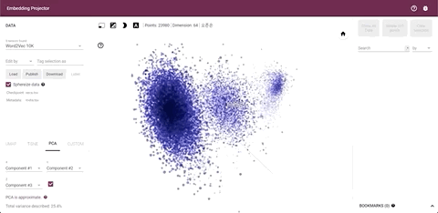

## word2vec

This project trains word embedding based on word2vec algorithm and Skip-gram model.

### Developer

Chansoo Kim
5.30.20

### Contents

- combine_text.py
    - This script combines all collected sentences into one single line with start and end tokens.
    - This will have you save a text file with a long line that is combined with start tokens and end tokens
- run_word2vec.py
    - This script trains word embeddings
    - This will have you save two 'tsv' files, so that you can visualize vectors.
- sample.txt
    -  This file has example sentences to train
- combined.txt
    - All sentences  are combined with start tokens and end tokens

### Usage

 1. Collect sentences and place only one sentence in each line in the text file, and put it in the wor2vec folder
 2. Run `combine_text.py`
 3. Run `run_word2vec.py` (This will generate two tsv files in word2vec directory)
 4. Visit [http://projector.tensorflow.org/](http://projector.tensorflow.org/) to run the visualizer online
 5. Click 'Load' on the website and upload two tsv files (first : vecs.tsv , second : meta.tsv)
 6. The module will visualize the words
 
### Environment

- Mac OSX Catalina 10.15.4
- Python v.3.7
- Tensorflow v.2.2.0
